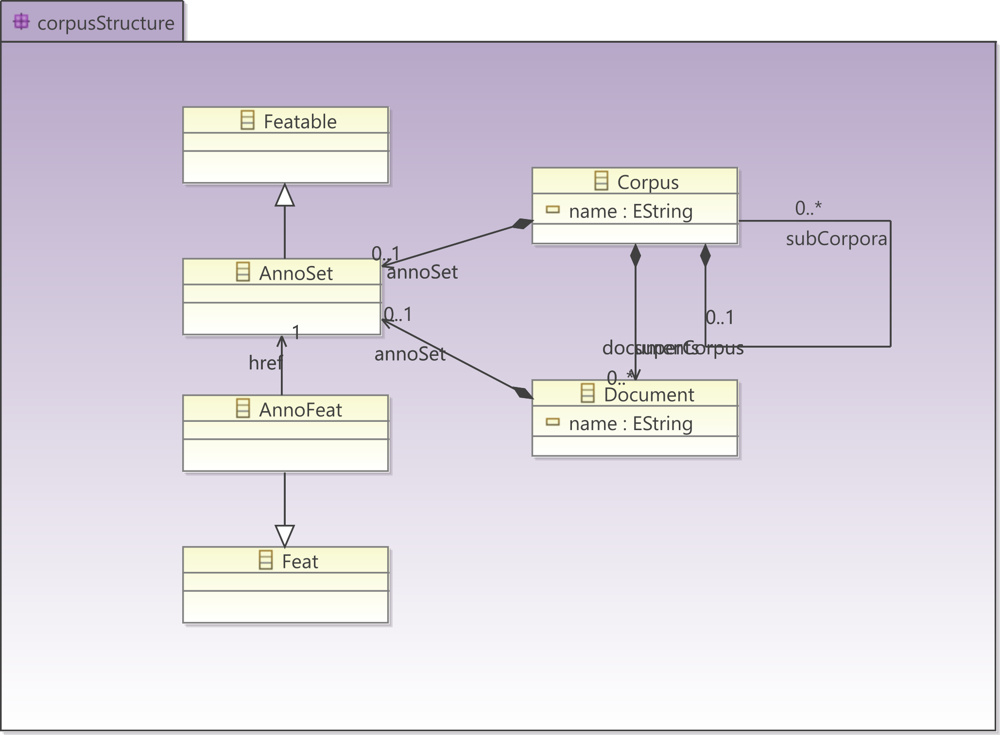
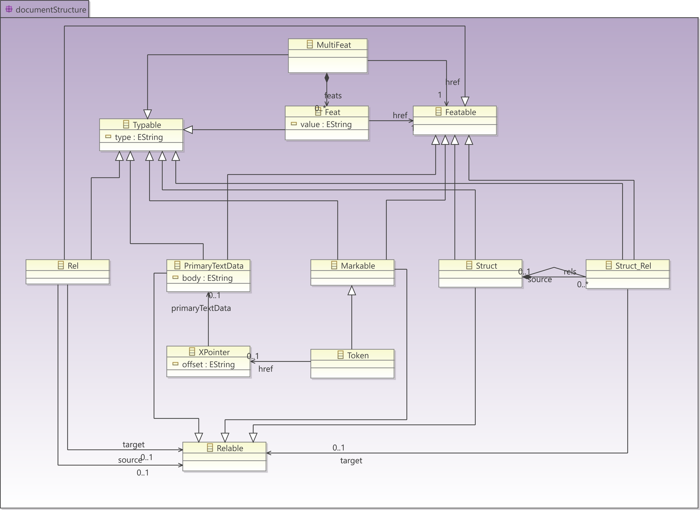

# Datamodel overview

PAULA projects are graphs dominated by a top level node refered to as a
[`corpus`](corpus-structure.md#corpus-and-subcorpus). Corpus objects comprise graphs of one or more
annotated [`document`](corpus-structure.md#documents) objects, optionally organized within a
tree of [`subcorpus`](corpus-structure.md#corpus-and-subcorpus) objects. The tree of corpus, subcorpora
and documents corresponds to a file system folder tree. Corpora,
subcorpora and documents can all receive [`metadata`](metadata.md)
annotations.

All documents must contain at least one source of [`primary text
data`](primary-text-data.md), possibly more in cases of [parallel
corpora](#parallel_corpora) or [dialogue data](special-scenarios.md#dialogue-data), and at
least one [`tokenization`](spans-and-markables.md#tokenizations-and-token-markables) of this data. Tokenized data may be annotated directly using features called [`feat`](spans-and-markables.md#feats), such as parts-of-speech, lemmatization, etc. Further hierarchical structures can
be built on top of tokens using flat span objects called [`mark`](spans-and-markables.md)
(i.e. markables) or hierarchically nestable objects called
[`struct`](hierarchical-structures.md#structs) (i.e. structures), which may also be annotated with
`feat` objects. The type of node or annotation (part-of-speech,
phrase-category etc.) is given by the type attribute of each set of
nodes or annotations.

Beyond the edges resulting from the construction of hierarchies through
structs, further non-hierarchical edges may be defined between any two
nodes in a document using pointing relations. Both edges connecting
structs to tokens or other structs and pointing relations may be
annotated using feats and given a type. All objects and annotations
below the document level may carry a PAULA [`namespace`](namespaces.md)
bundling relevant annotation layers which belong together under a common
identifier (note that these are not identical with XML namespaces). The
following two figures give an overview of this general data model for
the corpus/document structure and the structure of objects within them.
For details and examples of the individual model elements and their
specific XML serialization see the next chapters.

**Datamodel for (sub)corpus and document tree**

**Datamodel for document-internal objects**

