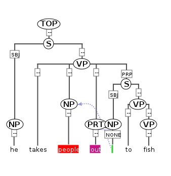

# Hierarchical structures

Hierarchical structures are used in PAULA for two different purposes:
for the creation of hierarchically nested annotation graphs (e.g. syntax
trees, rhetorical structure annotation, hierarchical topological fields)
and for the definition of structured `annoSet` objects (see
[annoSets](corpus-structure.md#annosets)). Hierarchical structures express the graph
semantic property that a parent node consists of its children, or in
reverse, that children nodes constitute their parent nodes. The
semantics of hierarchical edges is also called dominance (a parent node
dominates a child node), and they are consequently known as dominance
edges as well. This chapter describes hierarchical annotation graphs.
For non-hierarchical annotations see also [spans and markables](spans-and-markables.md).

## Structs

To form hierarchically nested (i.e. recursive) non-terminal nodes above
the token level, the `struct` element should be used. Directed acyclic
graphs (DAGs) of struct elements may be defined in struct files
according to `paula_struct.dtd`. The `struct` element is embedded within
a `structList` which determines the `@type` for all structs in the file.
It has only one attribute, an `@id` which allows it to become the target
of incoming edges. Outgoing edges are annotated using the child element
`rel`, which has its own `@type` (the type of edge) and an attribute
`@xlink:href` determining the target's id, as well as its own `@id`
attribute for further annotation (see annotating structs and rels). The
following example illustrates a simple syntax tree for the sentence "he
". The correpsonding syntax tree is also visualized in the next figure.

**Constructing a hierarchical syntax tree with `struct` elements
type**
```xml
<?xml version="1.0" standalone="no"?>
<!DOCTYPE paula SYSTEM "paula_struct.dtd">

<paula version="1.1">
<header paula_id="mycorpus.doc2_phrase"/>

<structList xmlns:xlink="http://www.w3.org/1999/xlink" 
type="phrase">
<struct id="phrase_1"> <!-- NP -->
    <!-- he -->
    <rel id="rel_1" type="edge" xlink:href="mycorpus.doc2.tok.xml#tok_1"/>
</struct>
<struct id="phrase_2"> <!-- VP -->
    <!-- takes -->
    <rel id="rel_2" type="edge" xlink:href="mycorpus.doc2.tok.xml#tok_2"/>
    <rel id="rel_3" type="edge" xlink:href="#phrase_3"/>
    <rel id="rel_4" type="edge" xlink:href="#phrase_4"/>
    <rel id="rel_5" type="edge" xlink:href="#phrase_5"/>
</struct>
<struct id="phrase_3"> <!-- NP -->
    <!-- people -->
    <rel id="rel_6" type="edge" xlink:href="mycorpus.doc2.tok.xml#tok_3"/>
    <!-- _ -->
    <rel id="rel_7" type="secedge" xlink:href="mycorpus.doc2.tok.xml#tok_5"/>
</struct>
<struct id="phrase_4"> <!-- PRT -->
    <!-- out -->
    <rel id="rel_8" type="edge" xlink:href="mycorpus.doc2.tok.xml#tok_4"/>
</struct>
<struct id="phrase_5"> <!-- S -->
    <rel id="rel_9" type="edge" xlink:href="#phrase_6"/>
    <rel id="rel_10" type="edge" xlink:href="#phrase_7"/>
</struct>
<struct id="phrase_6"> <!-- NP -->
    <!-- _ -->
    <rel id="rel_11" type="edge" xlink:href="mycorpus.doc2.tok.xml#tok_5"/>
</struct>
<struct id="phrase_7"> <!-- VP -->
    <!-- to -->
    <rel id="rel_12" type="edge" xlink:href="mycorpus.doc2.tok.xml#tok_6"/>
    <rel id="rel_13" type="edge" xlink:href="#phrase_8"/>
</struct>
<struct id="phrase_8"> <!-- VP -->
    <!-- fish -->
    <rel id="rel_14" type="edge" xlink:href="mycorpus.doc2.tok.xml#tok_7"/>
</struct>
<struct id="phrase_9"> <!-- S -->
    <rel id="rel_15" type="edge" xlink:href="#phrase_1"/> 
    <rel id="rel_16" type="edge" xlink:href="#phrase_2"/> 
</struct>
<struct id="phrase_10"> <!-- TOP -->
    <rel id="rel_17" type="edge" xlink:href="#phrase_9"/> 
</struct>
</structList>

</paula>
```

**Syntax tree for "he takes people out to fish"**\


In this example, the individual nodes in the tree from the figure above
are represented by `struct` elements. Each `struct` element contains
`rel` elements which define edge leading to its children. Thus
"phrase\_1" directly dominates a token "tok\_1", corresponding to the
word "he". Note that, since the tokens are in a separate file,
references to the tokens give a full href attribute with the token file
name: mycorpus.doc2.tok.xml\#tok\_1. Phrase nodes dominating other
phrase nodes within the same file do not require any prefix: "phrase\_9"
dominates "\#phrase\_5" directly. Most edges in the tree have been given
the edge `@type` "edge", but one edge, by which the NP above "people"
(marked in red in the figure above) indirectly dominates an empty token
between "out" and "to" (marked in green) with a different `@type`:
"secedge" (a 'secondary' edge). There is no limit to the amount of edge
types used in a document, but XML naming conventions should be followed
in giving type names that are ascii alphanumeric, without spaces and
beginning with an alphabetic character (see [naming
conventions](naming-conventions.md)). The node labels ("NP", "VP") and the
edge labels ("SBJ", "PRP") are not defined within the `struct` file, but
are given as separate annotation files: see [annotating structs and
rels](#annotating-structs-and-rels).

## Annotating structs and rels

Hierarchical graphs made of `struct` and `rel` elements may be further
annotated using `feat` elements, much like annotation
[spans](spans-and-markables.md#annotation-span-markables). To annotate `struct` nodes, use a `feat` file
pointing to the nodes and give the annotation name in the `@type`
attribute. The following example illustrates the phrase annotations for
the tree in the previous section.

**Annotating nodes from a `struct` file with `feat` annotations for phrase category: "cat"**
```xml
<?xml version="1.0" standalone="no"?>

<!DOCTYPE paula SYSTEM "paula_feat.dtd">
<paula version="1.1">

<header paula_id="mycorpus.doc2_phrase_cat"/>

<featList xmlns:xlink="http://www.w3.org/1999/xlink" type="cat" 
xml:base="mycorpus.doc2.phrase.xml">
    <feat xlink:href="#phrase_1" value="NP"/><!-- he -->
    <feat xlink:href="#phrase_2" value="VP"/><!-- takes -->
    <feat xlink:href="#phrase_3" value="NP"/><!-- people _ -->
    <feat xlink:href="#phrase_4" value="PRT"/><!-- out -->
    <feat xlink:href="#phrase_5" value="S"/><!-- _ to fish -->
    <feat xlink:href="#phrase_6" value="NP"/><!-- _ -->
    <feat xlink:href="#phrase_7" value="VP"/><!-- to fish -->
    <feat xlink:href="#phrase_8" value="VP"/><!-- fish -->
    <!-- he takes people out _ to fish -->
    <feat xlink:href="#phrase_9" value="S"/>
    <!-- he takes people out _ to fish -->
    <feat xlink:href="#phrase_10" value="TOP"/>
</featList>

</paula>
```

The annotation name is set as "cat" and it applies to the elements
"phrase\_1" to "phrase\_10" in the xml:base file, which contains the
phrase nodes. For conventions how to name the `@paula_id` and XML files,
see [naming conventions](naming-conventions.md).

Annotating edges works in a similar way, except that `rel` elements are
references instead of `struct` elements. It is possible to annotate
edges of multiple types in the same XML file, as long as the name of the
annotation being applied to them is identical. The following example
illustrates this using the edges from the example tree in the previous section (note that "rel\_7" had the type "secedge" while
the others had "edge", and also that not all edges have been annotated,
which is fine).

**Annotating edges from a `struct` file with `feat` annotations for phrase function: "func"**
```xml
<?xml version="1.0" standalone="no"?>

<!DOCTYPE paula SYSTEM "paula_feat.dtd">
<paula version="1.1">

<header paula_id="mycorpus.doc2_phrase_func"/>

<featList xmlns:xlink="http://www.w3.org/1999/xlink" type="func" 
xml:base="mycorpus.doc2.phrase.xml">
    <feat xlink:href="#rel_5" value="PRP"/><!-- _ to fish -->
    <feat xlink:href="#rel_9" value="SBJ"/><!-- _ -->
    <feat xlink:href="#rel_11" value="NONE"/><!-- _ -->
    <feat xlink:href="#rel_15" value="SBJ"/><!-- he -->
</featList>

</paula>
```

Just as with markables, it is also possible to specify multiple
annotations for the same nodes in one XML document using multiFeat files
(see [multiFeats](spans-and-markables.md#multifeats) for details).